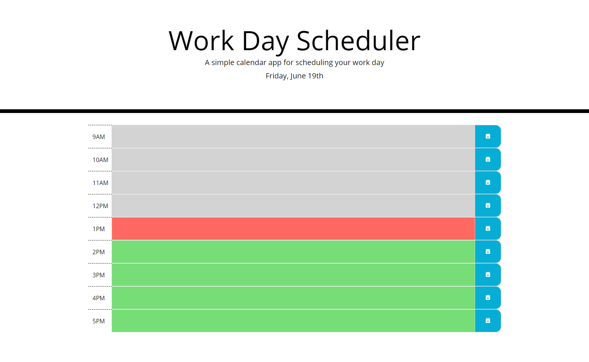

# Work Day Scheduler

## Description
A productivity application for keeping track of scheduled events throughout the day.  

##### Homescreen

Visit site [here](https://christopherconcannon.github.io/calendar-app/)

## Table of Contents
  * [Installation](#installation)
  * [Usage](#usage)
  * [License](#license)
  * [Technologies](#technologies)
  * [Contributing](#contributing)
  * [Testing](#testing)
  * [Questions](#questions)
  
## Installation
Clone project to a directory on your local machine and cd into calendar-app directory.   

## Usage
 Open index.html file in browser of your choice.  Click on text input field for corresponding hour block and enter event data.  To save event data, click on blue save button associated with the event block.  To edit or delete data, click into text input field again, then click save button.  Event blocks are color coded with respect to an event blocks relationship to the current time.  Event blocks from an earlier time than the current hour are highlighted in gray, the present event hour block is highlighted in red, and future event blocks are highlighted in green.

## License 
This project is covered under the MIT license 

## Technologies 
HTML5, CSS3, Bootstrap, JavaScript, jQuery

## Contributing
To see the guidelines adopted for contributing to this project, please view the [Contributor Covenant](https://www.contributor-covenant.org/version/2/0/code_of_conduct/code_of_conduct.txt)

## Testing
Tests coming soon

## Questions
Visit me at GitHub  
[christopherConcannon](https://github.com/christopherConcannon)
  
If you have any questions or would like to contact me, please email me at  
[cmcon@yahoo.com](mailto:cmcon@yahoo.com)
