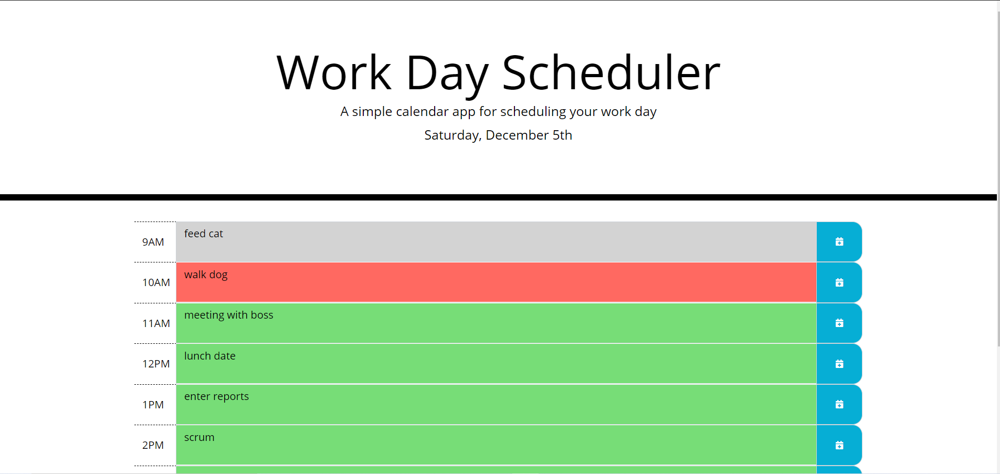

# calendar-app
A productivity application for keeping track of workday events.  Click on text input field for corresponding hour block and enter event data.  To save event data, click on blue save button associated with the event block.  To edit or delete data, click into text input field again, then click save button.  Event blocks are color coded with respect to an event blocks relationship to the current time.  Event blocks from an earlier time than the current hour are highlighted in gray, the present event hour block is highlighted in red, and future event blocks are highlighted in green

Visit site [https://christopherconcannon.github.io/calendar-app/](https://christopherconcannon.github.io/calendar-app/).

